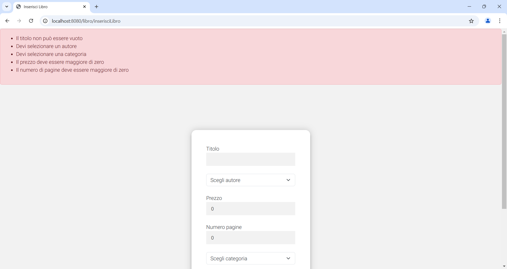

# Gestionale libreria

Questo progetto tratta un'app di una libreria digitale

## Descrizione

Questa app vuole fornire il servizio di una libreria digitale da portare sempre con te su ogni dispositivo elettronico(responsive). Ti permette di aggiungere, modificare o eliminare sia libri che autori che categorie in modo da tenere traccia di tutte le tue letture. Per accedere al tuo profilo devi prima registrarti e poi puoi fare il login con le tue credenziali. Puoi anche gestire il tuo profilo modificandolo o eliminandolo. Puoi vedere la lista di tutti i tuoi libri, le categorie e gli autori oppure cercare un libro per categoria o per autore. Questa app è stata realizzata con diverse tecnologie: java, spring, jpa, sql per quanto riguarda il backend e javascript,html,css e Bootstrap per quanto riguarda il frontend.

## Funzionalità

L'app include le seguenti funzionalità:

- collegamento al database
- login animato
- home animata
- sito responsive per smartphone e tablet

## Tecnologie utilizzate

L'app è stato sviluppato utilizzando le seguenti tecnologie:
- spring
- java
- jpa
- sql
- javascript
- HTML
- Bootstrap
- CSS

## Licenza

<!-- Questo progetto è stato rilasciato sotto la licenza MIT. Per ulteriori informazioni, leggere il file `LICENSE.md`. -->

## Crediti

Questo progetto è stato sviluppato da Katia Falletti.(https://it.linkedin.com/in/katia-falletti-616890225?trk=people-guest_people_search-card)
